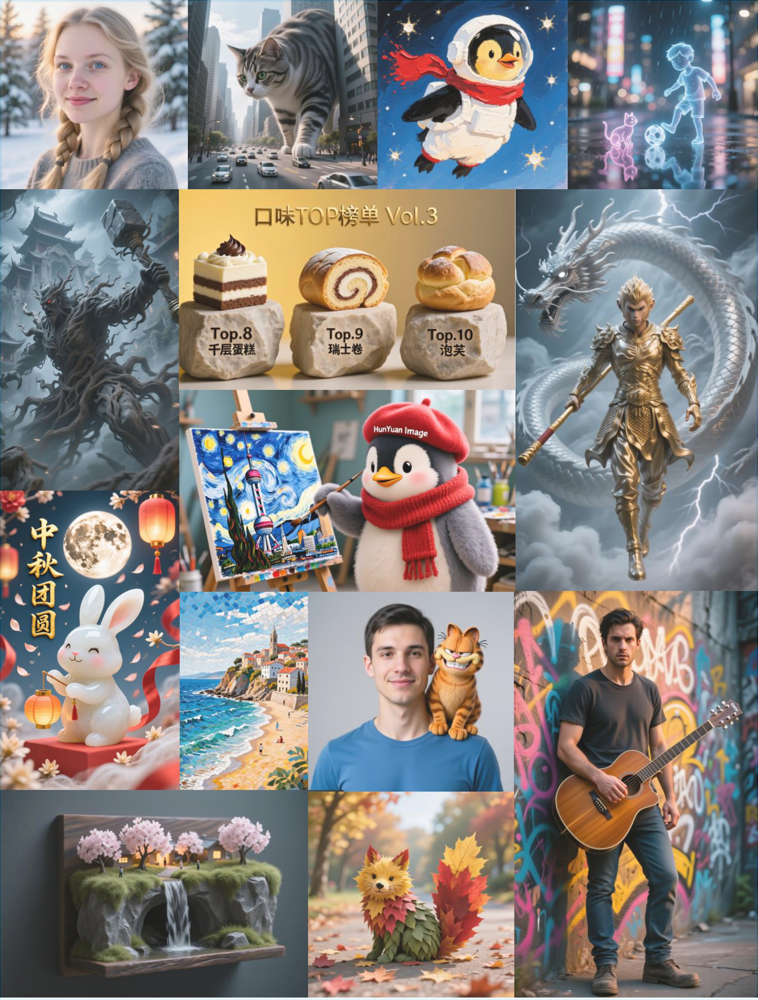

[English](./README.md)

<p align="center">
  
</p>

<div align="center">

# 混元图像 2.1：一种用于高分辨率（2K）文本到图像生成的高效扩散模型

</div>


<p align="center"> &nbsp&nbsp🤗 <a href="https://huggingface.co/tencent/HunyuanImage-2.1">HuggingFace</a>&nbsp&nbsp | 
💻 <a href="https://hunyuan.tencent.com/modelSquare/home/play?modelId=286&from=/visual">官网体验 试用我们的模型!</a>&nbsp&nbsp
</p>


<p align="center">
    👏 加入我们的 <a href="assets/WECHAT.md" target="_blank">WeChat</a> 和 <a href="https://discord.gg/ehjWMqF5wY">Discord</a>
</p>


-----

本仓库包含我们关于混元图像 2.1 的 PyTorch 模型定义、预训练权重，以及推理/采样代码。您可以在[官网](https://hunyuan.tencent.com/modelSquare/home/play?modelId=286&from=/visual)**直接体验**我们的模型，更多可视化示例请访问我们的[项目主页](https://hunyuan.tencent.com/image/en?tabIndex=0)。

<div align="center">
  
</div>


## 🔥🔥🔥 最新动态
- 2025 年 9 月 18 日：✨ 欢迎体验 [PromptEnhancer-32B 模型](https://huggingface.co/PromptEnhancer/PromptEnhancer-32B) 以获得更高质量的提示词增强！
- 2025 年 9 月 18 日：✨ [HunyuanImage-2.1 的 ComfyUI 工作流](https://github.com/KimbingNg/ComfyUI-HunyuanImage2.1) 现已开放体验！
- 2025 年 9 月 16 日：👑 我们在 Arena 文生图开源模型排行榜上获得第一名！[排行榜](https://artificialanalysis.ai/text-to-image/arena/leaderboard-text)
- 2025 年 9 月 12 日：🚀 发布 FP8 量化模型！仅需 24GB GPU 显存即可生成 2K 图像！
- 2025 年 9 月 8 日：🚀 发布混元图像 2.1 的推理代码与模型权重。


## 介绍
我们很高兴推出**混元图像 2.1**，这是一个 170 亿参数的文生图模型，能够生成**2K（2048 × 2048）分辨率**的图像。

我们的架构包含两个阶段：
1. **基础文生图模型**：第一阶段是一个文生图模型，利用两个文本编码器：一个多模态大语言模型（MLLM）来改善图像-文本对齐，以及一个多语言、字符感知编码器来增强各种语言的文本渲染。 
2. **精修模型**：第二阶段引入了一个精修模型，进一步提升了图像质量和清晰度，同时最小化伪影。

👑 我们在 Arena 文生图开源模型排行榜上获得第一名。

<div align="center">
  
</div>

## 🎉 混元图像 2.1 关键特性

- **高质量生成**：高效生成超高清（2K）图像，具有电影级构图。
- **多语言支持**：原生支持中文和英文提示词。
- **先进架构**：基于多模态、单流和双流结合的 DiT（Diffusion Transformer）骨干网络。
- **字形感知处理**：利用 ByT5 的文本渲染能力，提升文本生成准确性。
- **灵活宽高比**：支持多种图像宽高比（1:1, 16:9, 9:16, 4:3, 3:4, 3:2, 2:3）。
- **提示词增强**：自动重写提示词，提升描述准确性和视觉质量。

## 📜 系统要求

**硬件和操作系统要求：**
- 支持 CUDA 的 NVIDIA GPU。

  **目前最低要求：** 24 GB GPU 显存，用于 2048x2048 图像生成。
  
  > **注意：** 上述显存要求是在启用模型 CPU offloading 和 FP8 量化的情况下测量的。如果您的 GPU 有足够的显存，可以禁用 offloading 以提高推理速度。
- 支持的操作系统：Linux。


## 🛠️ 依赖与安装

1. 克隆仓库：
```bash
git clone https://github.com/Tencent-Hunyuan/HunyuanImage-2.1.git
cd HunyuanImage-2.1
```

2. 安装依赖：
```bash
pip install -r requirements.txt
pip install flash-attn==2.7.3 --no-build-isolation
```

## 🧱 模型下载

模型的下载与说明请参考[这里](ckpts/checkpoints-download.md)。

## 🔑 使用

### 提示词增强

提示词增强在使我们的模型生成高质量图像方面发挥着**关键作用**。通过编写更长、更详细的提示词，生成的图像将得到显著改善。我们鼓励您制作全面和描述性的提示词以获得最佳的图像质量。

我们强烈推荐您尝试 [PromptEnhancer-32B 模型](https://huggingface.co/PromptEnhancer/PromptEnhancer-32B) 以获得更高质量的提示词增强。

### 文生图
HunyuanImage-2.1 **仅支持 2K** 图像生成（如 1:1 时为 2048x2048，16:9 时为 2560x1536 等）。
使用 1K 分辨率生成图像可能会导致画质下降与瑕疵。

此外，我们**强烈建议**使用完整的生成流程以获得更高画质（即启用提示词增强和精修功能）。

| 模型类型               | 模型名称                | 描述                             | num_inference_steps | guidance_scale | shift |
|--------------------------|---------------------------|-----------------------------------------|---------------------|----------------|-------|
| 基础文生图模型 | hunyuanimage2.1           | 未蒸馏模型，质量最佳。 | 50                  | 3.5            | 5     |
| 蒸馏文生图模型 | hunyuanimage2.1-distilled | 蒸馏模型，推理更快    | 8                   | 3.25           | 4     |
| 精修模型                  | hunyuanimage-refiner      | 精修模型                       | N/A                 | N/A            | N/A   |


```python
import os
os.environ['PYTORCH_CUDA_ALLOC_CONF'] = 'expandable_segments:True'
import torch
from hyimage.diffusion.pipelines.hunyuanimage_pipeline import HunyuanImagePipeline

# 支持的 model_name：hunyuanimage-v2.1, hunyuanimage-v2.1-distilled
model_name = "hunyuanimage-v2.1"
pipe = HunyuanImagePipeline.from_pretrained(model_name=model_name, use_fp8=True)
pipe = pipe.to("cuda")

# 输入提示词
prompt = "A cute, cartoon-style anthropomorphic penguin plush toy with fluffy fur, standing in a painting studio, wearing a red knitted scarf and a red beret with the word \"Tencent\" on it, holding a paintbrush with a focused expression as it paints an oil painting of the Mona Lisa, rendered in a photorealistic photographic style."

# 生成不同宽高比的图像
aspect_ratios = {
    "16:9": (2560, 1536),
    "4:3": (2304, 1792),
    "1:1": (2048, 2048),
    "3:4": (1792, 2304),
    "9:16": (1536, 2560),
}

width, height = aspect_ratios["1:1"]

image = pipe(
    prompt=prompt,
    width=width,
    height=height,
    # 如果您已经使用提示词增强来增强提示词，请禁用 reprompt
    use_reprompt=False,  # 启用提示词增强（可能会导致更高的显存使用）
    use_refiner=True,   # 启用精修模型
    # 对于蒸馏模型，使用 8 步以加快推理速度
    # 对于非蒸馏模型，使用 50 步以获得更好质量
    num_inference_steps=8 if "distilled" in model_name else 50, 
    guidance_scale=3.25 if "distilled" in model_name else 3.5,
    shift=4 if "distilled" in model_name else 5,
    seed=649151,
)

image.save("generated_image.png")
```

## 更多示例
我们的模型可以根据复杂指令生成高质量、具有创意的图像。

<div align="center">
  
</div>

我们建议使用更长、更详细的提示词。可以尝试一下我们提供的提示词。
 
<p align="center">
<table>
<thead>
<tr>
    <th>Index</th>  <th>用户提示词</th> <th>图像</th>
</tr>
</thead>
<tbody>
<tr>
    <td>1</td> <td>宏伟教堂的内部，穹顶下方的中央矗立着一尊小巧的维纳斯雕像，微微侧对镜头。雕像没有双手，布满裂纹，表面若干古老的水泥片剥落，露出内部真人质感的牛奶肌肤。雕像穿着薄薄的白色婚纱，在雕像的身后，一只浮空水泥断手轻轻提起长长的婚纱拖尾；在雕像的头顶上方，另一只浮空水泥断手正为她戴上一个由白色花朵组成的花环，雕像本身是没有双手的。教堂穹顶上布满彩色玻璃窗，一束阳光从上往下照射到雕像上，形成丁达尔效应，光斑点点洒在雕像的脸庞和胸前。充满神性的光辉，背景微微虚化，物体的边缘模糊柔和。拉斐尔前派的梦幻朦胧美学风格。</td> <td></td>
</tr>
<tr>
    <td>2</td> <td>A hyper-realistic photograph of a crystal ball diorama sitting atop fluffy forest moss and surrounded by scattered sunlight. Inside, detailed diorama features a Tencent meeting room, an animated chat bubble sculpture, and several joyful penguins—one wearing a graduation cap, others playing soccer and waving tiny banners. The base of the crystal sphere boldly presents ""Tencent"" in large, crisp, white 3D letters. Background is softly blurred and bokeh-rich, emphasizing the cute, vibrant details of the sphere.</td>  <td></td>
</tr>
<tr>
    <td>3</td> <td>A close-up portrait of an elderly Italian man with deeply wrinkled skin, expressive hazel eyes, and a neatly trimmed white mustache. His olive-toned complexion shows the marks of sun and age, and he wears a flat cap slightly tilted to the side. He smiles faintly, revealing warmth and wisdom, while holding a small espresso cup in one hand. The softly blurred background shows a rustic stone wall with climbing ivy, captured in a realistic photography style.</td> <td></td>
</tr>
<tr>
    <td>4</td> <td>An open vintage suitcase on a neutral, softly lit background. The suitcase is made of deep brown, worn leather with visible scuffs and creases, and its interior is lined with dark, plush fabric. Inside the suitcase is a meticulously crafted miniature landscape of China, featuring the Great Wall of China winding across model mountains, the pagoda roofs of the Forbidden City, and a representation of the terracotta army, all interwoven with vibrant green rice paddies.  On the side of the suitcase, a text "China" is labeled. The entire diorama is bathed in warm, ethereal light, with a dreamy lens bloom and soft, glowing highlights. Photorealistic style, ultra-detailed textures, cinematic lighting.</td> <td></td>
</tr>
</tbody>
</table>
</p>


为了提升生成图像的质量和细节，我们使用了提示词重写模型。该模型能够自动增强用户提供的文本提示词，添加详细和描述性的信息。
<p align="center">
<table>
<thead>
<tr>
    <th>Index</th>  <th>用户提示词</th> <th>增强提示词</th> <th>图像</th>
</tr>
</thead>
<tbody>
<tr>
    <td>1</td> <td>Wildlife poster for Serengeti plains. Wide-eyed chibi explorer riding friendly lion cub. 'Serengeti: Roar of Adventure' in whimsical font. 'Where Dreams Run Wild' tagline. Warm yellows and soft browns.</td> <td> A wildlife poster design for the Serengeti plains features a central illustration of a chibi-style explorer riding a lion cub, set against a backdrop of rolling hills. At the top of the composition, the title "Serengeti: Roar of Adventure" is displayed in a large, whimsical font with decorative, swirling letters. The main scene depicts a wide-eyed chibi explorer, characterized by a large head and a small body, sitting atop a friendly lion cub. The explorer wears a green explorer's hat, a backpack, and holds onto the cub's mane, looking forward with a look of wonder. The lion cub, with a light brown mane and a smiling expression, strides forward, its body rendered in warm orange tones. In the background, the Serengeti plains are illustrated with rolling hills and savanna grass, all in shades of warm yellow and soft brown. Below the main illustration, the tagline "Where Dreams Run Wild" is written in a smaller, elegant script. The overall presentation is that of a poster design, combining a cute chibi illustration style with playful, whimsical typography.</td> <td></td>
</tr>
<tr>
    <td>2</td> <td>Energetic poster for New York City. Anime businesswoman hailing a taxi with skyscrapers and Times Square signs around. 'NYC: Bright Ambitions' in urban graffiti font. 'Own Every Dream' tagline. Saturated yellows, reds, and sharp blues.</td> <td>An energetic poster for New York City unfolds, featuring a dynamic scene with an anime-style businesswoman in the midst of hailing a taxi. The central figure is a young woman with large, expressive eyes and dark hair styled in a bob, wearing a professional blue business suit with motion lines indicating movement. She stands on a bustling street, her arms outstretched as she calls for a classic yellow taxi cab that is approaching. In the background, towering skyscrapers with sleek, anime-inspired architecture rise into the sky, adorned with vibrant, glowing billboards and neon signs characteristic of Times Square. Across the top of the poster, the text "NYC: Bright Ambitions" is displayed in a large, stylized urban graffiti font, with spray-paint-like edges. Below this main title, the tagline "Own Every Dream" is written in a smaller, clean font. The entire composition is rendered with saturated colors, dominated by bright yellows, reds, and sharp blues. The overall presentation is a fusion of anime illustration and graphic design.</td> <td></td>
</tr>
<tr>
    <td>3</td> <td>An artistic studio portrait captures a high fashion model in a striking, dynamic pose. Her face is a canvas for avant-garde makeup, defined by bold, geometric applications of primary colors. She wears a sculptural, unconventional garment, emphasizing clean lines and form. The scene is illuminated by dramatic studio lighting, creating sharp contrasts and highlighting her features against an abstract, blurred background of colors. The image is presented in a realistic photography style.</td> <td> An artistic studio portrait captures a high fashion model in a striking, dynamic pose, her body twisted with one arm raised high to convey energy and movement. Her face serves as a canvas for avant-garde makeup, featuring bold, geometric applications of primary colors; vibrant yellow triangles are painted on her forehead, and electric blue lines accentuate her eye sockets. She wears a sculptural, unconventional garment made of a stiff, matte white fabric, with asymmetrical panels that wrap around her torso, emphasizing clean lines and form. Illuminated by dramatic studio lighting, with a strong beam from the side casting sharp shadows and highlighting the contours of her face and body against an abstract, blurred background of purples and oranges, creating a bokeh effect. Realistic photography style. </td> <td></td>
</tr>
<tr>
    <td>4</td> <td>An environmental portrait of a chef, captured with a focused expression in a bustling kitchen. He holds culinary tools, his gaze fixed on his work, embodying passion and creativity. The background is a blur of motion with stainless steel counters, all illuminated by a warm ambient light. The image is presented in a realistic photography style.</td> <td> An environmental portrait of a male chef in the midst of work within a bustling kitchen. The chef, as the central subject and viewed from the chest up, has a focused expression with a furrowed brow, his gaze directed downward at the culinary tools he holds. He wears a professional white chef‘s jacket and a traditional toque, with flour lightly dusting his face and clothes. In his hands, he grips a large chef’s knife and a metal spatula, poised over an unseen cooking surface. The background is a dynamic blur of motion, with out-of-focus shapes of stainless steel counters, pots, and other kitchen equipment suggesting a busy environment. Warm ambient light from overhead fixtures casts a golden hue, creating highlights on the chef‘s jacket and the tools. Realistic photography style, characterized by a shallow depth of field that emphasizes the subject while conveying the energy and creativity of the kitchen. </td>  <td></td>
</tr>
</tbody>
</table>
</p>

## 📈 对比

### SSAE 评测
SSAE（结构化语义对齐评估）是一种基于先进多模态大语言模型（MLLMs）的图文对齐智能评测指标。我们在 12 个类别中共提取了 3500 个关键要点，然后利用多模态大语言模型，基于图像的视觉内容，将生成的图像与这些关键要点进行比对，自动完成评估与打分。平均图像准确率（Mean Image Accuracy）表示以图像为单位在所有关键要点上的平均得分，而全局准确率（Global Accuracy） 则直接对所有关键要点的平均得分进行计算。

<p align="center">
<table>
<thead>
<tr>
    <th rowspan="2">模型</th>  <th rowspan="2">开源</th> <th rowspan="2">平均图像准确率</th> <th rowspan="2">全局准确率</th> <th colspan="4" style="text-align: center;">主体</th> <th colspan="3" style="text-align: center;">次要主体</th> <th colspan="2" style="text-align: center;">场景</th> <th colspan="3" style="text-align: center;">其他</th>
</tr>
<tr>
    <th>名词</th> <th>关键属性</th> <th>其他属性</th> <th>动作</th> <th>名词</th> <th>属性</th> <th>动作</th> <th>名词</th> <th>属性</th> <th>镜头</th> <th>风格</th> <th>构图</th>
</tr>
</thead>
<tbody>
<tr>
    <td>FLUX-dev</td> <td>✅</td> <td>0.7122</td> <td>0.6995</td> <td>0.7965</td> <td>0.7824</td> <td>0.5993</td> <td>0.5777</td> <td>0.7950</td> <td>0.6826</td> <td>0.6923</td> <td>0.8453</td> <td>0.8094</td> <td>0.6452</td> <td>0.7096</td> <td>0.6190</td>
</tr>
<tr>
    <td>Seedream-3.0</td> <td>❌</td> <td>0.8827</td> <td>0.8792</td> <td>0.9490</td> <td>0.9311</td> <td>0.8242</td> <td>0.8177</td> <td>0.9747</td> <td>0.9103</td> <td>0.8400</td> <td>0.9489</td> <td>0.8848</td> <td>0.7582</td> <td>0.8726</td> <td>0.7619</td>
</tr>
<tr>
    <td>Qwen-Image</td> <td>✅</td> <td>0.8854</td> <td>0.8828</td> <td>0.9502</td> <td>0.9231</td> <td>0.8351</td> <td>0.8161</td> <td>0.9938</td> <td>0.9043</td> <td>0.8846</td> <td>0.9613</td> <td>0.8978</td> <td>0.7634</td> <td>0.8548</td> <td>0.8095</td>
</tr>
<tr>
    <td>GPT-Image</td>  <td>❌</td> <td> 0.8952</td> <td>0.8929</td> <td>0.9448</td> <td>0.9289</td> <td>0.8655</td> <td>0.8445</td> <td>0.9494</td> <td>0.9283</td> <td>0.8800</td> <td>0.9432</td> <td>0.9017</td> <td>0.7253</td> <td>0.8582</td> <td>0.7143</td>
</tr>
<tr>
    <td><strong>HunyuanImage 2.1</strong></td> <td>✅</td> <td><strong>0.8888</strong></td> <td><strong>0.8832</strong></td> <td>0.9339</td> <td>0.9341</td> <td>0.8363</td> <td>0.8342</td> <td>0.9627</td> <td>0.8870</td> <td>0.9615</td> <td>0.9448</td> <td>0.9254</td> <td>0.7527</td> <td>0.8689</td> <td>0.7619</td>
</tr>
</tbody>
</table>
</p>

从 SSAE 的评估结果上看，我们的模型在语义对齐上目前达到了开源模型上最优的效果，并且非常接近闭源商业模型 (GPT-Image) 的效果。

### GSB 评测

<p align="center">
  
</p>
我们采用了 GSB 评测方法，该方法常用于从整体图像感知角度评估两个模型之间的相对性能。我们共使用了 1000 条文本提示，并生成等数量的图像样本。为保证公平比较，我们仅进行一次推理，避免任何挑选结果的行为。与基线方法比较时，我们对所有选定模型均保持默认设置。评测由 100 多位专业评审完成。
从结果来看，HunyuanImage 2.1 相对于 Seedream3.0（闭源）的相对胜率为 -1.36%，相对于 Qwen-Image（开源）为 2.89%。GSB 评测结果表明，作为开源模型的 HunyuanImage 2.1，其图像生成质量已达到可与闭源商业模型（Seedream3.0）相媲美的水平，同时相较于同类开源模型（Qwen-Image）展现出一定优势。这充分验证了 HunyuanImage 2.1 在文生图任务中的技术先进性和实践价值。

### 联系
欢迎加入我们的 Discord 服务器或微信交流群，无论是交流想法、探索合作机会，还是提出任何问题，我们都非常欢迎。您也可以在 GitHub 上提交 issue 或 pull request。您的反馈对我们非常宝贵，这也是 HunyuanImage 不断进步的动力。感谢您加入我们的社区！


## 🔗 BibTeX

如果本项目对你的研究或应用有帮助，请引用：

```BibTeX
@misc{HunyuanImage-2.1,
  title={HunyuanImage 2.1: An Efficient Diffusion Model for High-Resolution (2K) Text-to-Image Generation},
  author={Tencent Hunyuan Team},
  year={2025},
  howpublished={\url{https://github.com/Tencent-Hunyuan/HunyuanImage-2.1}},
}
```

## 致谢

感谢以下开源项目与社区为开放研究和探索所做的贡献：[Qwen](https://huggingface.co/Qwen)、
[FLUX](https://github.com/black-forest-labs/flux)、[diffusers](https://github.com/huggingface/diffusers) 与 [HuggingFace](https://huggingface.co)。

## Github Star 历史
<a href="https://star-history.com/#Tencent-Hunyuan/HunyuanImage-2.1&Date">
 <picture>
   <source media="(prefers-color-scheme: dark)" srcset="https://api.star-history.com/svg?repos=Tencent-Hunyuan/HunyuanImage-2.1&type=Date&theme=dark" />
   <source media="(prefers-color-scheme: light)" srcset="https://api.star-history.com/svg?repos=Tencent-Hunyuan/HunyuanImage-2.1&type=Date" />
   
 </picture>
</a>